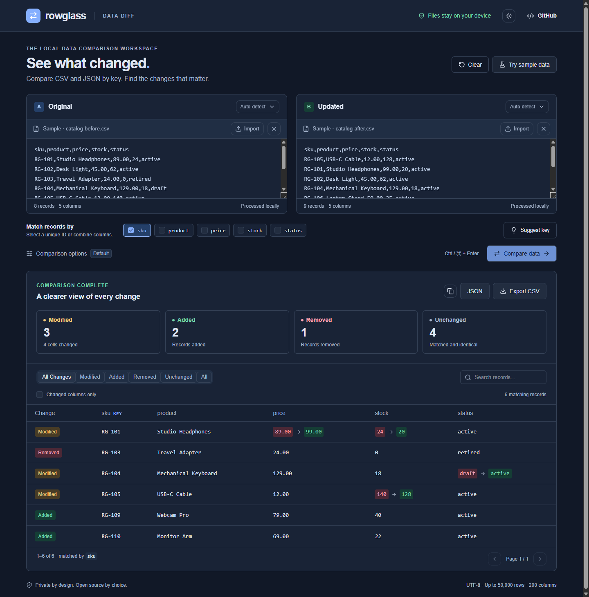

# Rowglass

**CSV & JSON diff, matched by key — not by line number.**

Compare two data exports, find changed cells, and export a reviewable report. Your data stays in your browser.

[Try Rowglass](https://yougan001.github.io/rowglass/) · [中文说明](README.zh-CN.md) · [Releases](https://github.com/Yougan001/rowglass/releases) · [Report a bug](https://github.com/Yougan001/rowglass/issues/new?template=bug_report.yml)

[](https://github.com/Yougan001/rowglass/actions/workflows/test.yml)
[](LICENSE)


## When a text diff is not enough

An export gets reordered. A product disappears. Three prices change. A line-by-line diff shows noise; Rowglass matches the same records by ID and shows what actually changed.

Use it to review product catalogs, inventory snapshots, contact exports, configuration tables or database query results. Export Excel or Google Sheets data as CSV first.

- **Mix formats:** CSV, TSV, semicolon-separated text and JSON arrays of objects.
- **Match by unique or composite keys:** use `id`, `sku`, or several columns together.
- **Inspect cell-level changes:** added, removed, modified and unchanged records, plus added/removed columns.
- **Tune the comparison:** ignore columns, trim surrounding whitespace, ignore case, set absolute numeric tolerance or compare strict JSON types.
- **Review efficiently:** search, status filters, changed-columns-only view and 50-row pagination.
- **Keep a report:** downloadable CSV and JSON, or copy a summary.
- **Work locally:** no account, upload endpoint, analytics or API key. Light/dark themes and a mobile layout.
- **Automate checks:** a dependency-free Node.js CLI uses the same engine as the browser.

<details>
<summary>Dark mode screenshot</summary>



</details>

## Try it in a minute

1. Open the [web app](https://yougan001.github.io/rowglass/). It starts with clearly labeled fictional sample data.
2. Drop or paste an original export on the left and an updated export on the right.
3. Choose a unique key present in both sources; select several columns for a composite key.
4. Select **Compare data** (or press Ctrl/Cmd + Enter), review the changes, and export a report.

Try the included [before.csv](examples/before.csv) and [after.json](examples/after.json), using `sku` as the key. Expected result: **2 added, 1 removed, 3 modified, 4 unchanged, 4 changed cells**.

## Run locally

Requires **Node.js 22.13+** and npm.

```sh
git clone https://github.com/Yougan001/rowglass.git
cd rowglass
npm ci
npm run dev
```

Open the local URL printed in the terminal. To run a production build:

```sh
npm run build
npm run preview
```

The web app is static; deploy the generated `dist/` directory to a static host. For a subpath, set `ROWGLASS_BASE_PATH` (for example, `/rowglass/`) when building. The included GitHub Pages workflow demonstrates this.

## Command-line usage

The CLI requires Node.js but **no npm install**. Clone or download the source, then run:

```sh
node cli/rowglass.mjs examples/before.csv examples/after.json --key sku
node cli/rowglass.mjs before.csv after.csv --key country --key id
node cli/rowglass.mjs before.csv after.json --key id --ignore updated_at --tolerance 0.01
node cli/rowglass.mjs before.csv after.csv --key id --output changes.csv
node cli/rowglass.mjs before.csv after.json --key id --json
```

Options: repeat `--key` or `--ignore`; add `--trim-whitespace`, `--ignore-case` or `--strict-types`. Run `--help` for details. `--output` creates a CSV report and refuses to overwrite an existing file.

| Exit code | Meaning |
| --- | --- |
| `0` | No record or schema differences |
| `1` | Differences found — including the sample command above |
| `2` | Invalid input or another error |

The CLI is not currently published to npm.

## Comparison rules and limits

- Row order does not matter. Keys must be non-empty simple values and unique in each source. Duplicate keys are rejected instead of guessed.
- Column names are case-sensitive. CSV headers must be non-empty and unique, and every row must have the expected number of fields.
- Quoted separators, escaped quotes, embedded newlines, CRLF and UTF-8 BOM are supported. The browser importer rejects non-UTF-8 files.
- By default, JSON number `1` and CSV string `"1"` compare equally. Leading-zero strings such as `"001"` remain distinct from `"1"`. Strict types can distinguish numbers and strings.
- Trimming and case folding affect compared values, **not keys**. Numeric tolerance is absolute, not a percentage.
- Missing properties, JSON `null` and empty strings remain distinct.
- Nested objects/arrays are compared as whole cells. Object property order is ignored; array order is significant. Nesting beyond 30 levels is rejected.
- Store large identifiers as strings. Unsafe JSON integers and non-finite JSON numbers are rejected to avoid silently rounded comparisons.
- Per source: **50,000 records, 200 columns and 5 million characters**; file import also checks a **20 MB pre-decoding limit**. These are safeguards, not a speed guarantee on every device.
- XLSX, NDJSON, fuzzy matching and editing/merging files are outside this release.

CSV exports neutralize spreadsheet formula prefixes. The JSON report preserves the structured comparison, including all records, options and schema changes; it is not limited to the currently filtered table.

## Privacy

Comparison runs in memory on your device. Rowglass does not send source data to a server or keep it in browser storage. Refreshing clears your inputs. After the page has loaded, comparison works without a network connection; offline page loading is not provided.

Opening a hosted page still contacts its hosting provider for application files. Exported reports contain your data, so handle them accordingly. For sensitive work, inspect the source and run it locally.

## Development and contributing

React + TypeScript + Vite for the interface; plain JavaScript for the shared comparison engine and CLI.

```sh
npm test
npm run lint
npm run build
```

There are 31 automated tests covering parsing, comparison, safety limits, exports and CLI behavior. CI runs core tests on Windows and Linux with Node.js 22 and 24, plus a web lint/build job. See [test notes](docs/testing.md), [contributing](CONTRIBUTING.md) and the [security policy](SECURITY.md).

If Rowglass helps with a real workflow, a star or an issue describing that workflow helps others discover it.

## License

[MIT](LICENSE) © 2026 Yougan001
