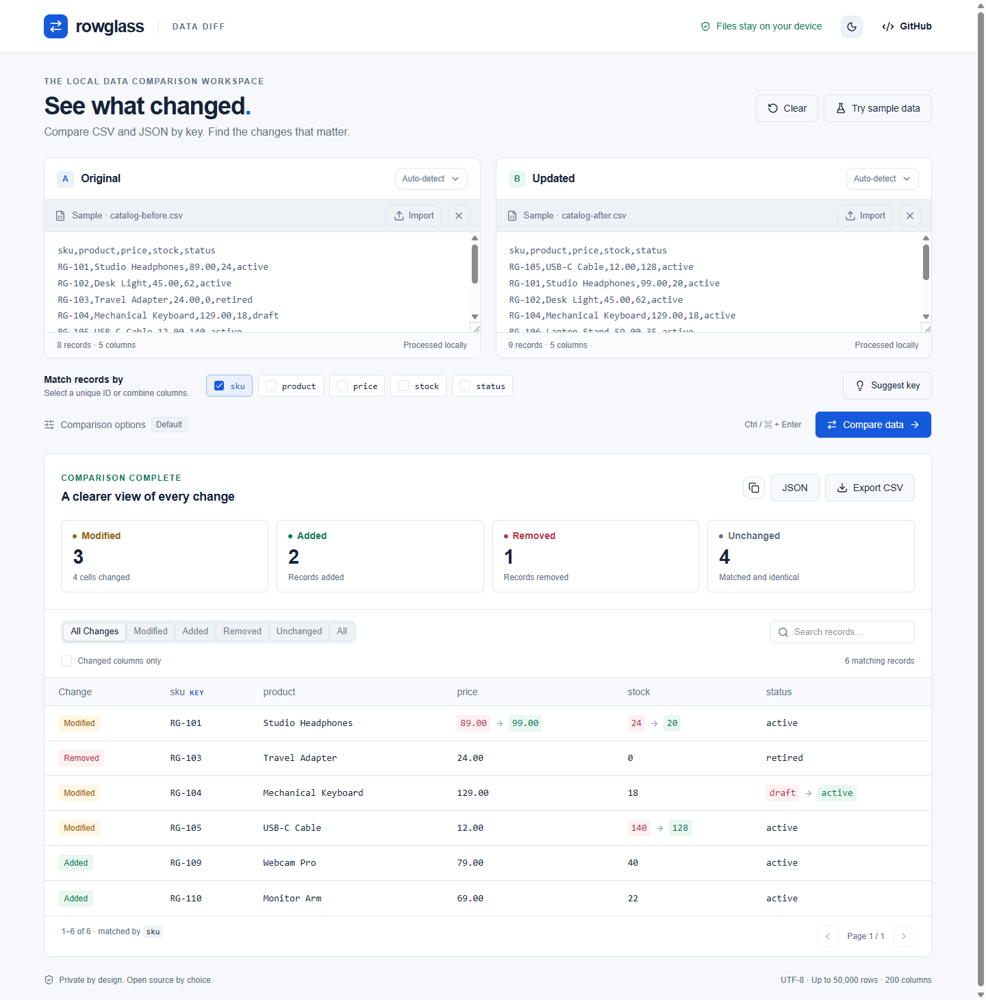

# Rowglass

**按主键对齐的 CSV / JSON 数据对比工具，而不是逐行文本对比。**

比较两份导出文件，定位新增、删除和修改，导出方便复核的差异报告。数据在浏览器本地处理。

[在线使用](https://yougan001.github.io/rowglass/) · [English](README.md) · [下载版本](https://github.com/Yougan001/rowglass/releases) · [反馈问题](https://github.com/Yougan001/rowglass/issues)



## 解决什么问题

两次导出的数据顺序变了，普通文本 diff 会显示大量无关差异。Rowglass 根据 ID、SKU 或多个字段组成的联合主键对齐记录，让你直接看到价格、库存、状态等字段的真实变化。

适合核对商品目录、库存快照、联系人导出、配置表和数据库查询结果。Excel / Google Sheets 请先导出成 CSV。

- 支持 CSV、TSV、分号分隔文件和 JSON 对象数组，左右可以使用不同格式。
- 唯一主键或联合主键匹配，显示新增、删除、修改、未变化记录及列结构变化。
- 搜索、状态筛选、只看变化列、每页 50 条结果。
- 可忽略指定列、首尾空格或大小写，设置绝对数值容差，启用严格类型比较。
- 导出 CSV / JSON 报告，复制摘要，支持明暗主题和手机布局。
- 不需要账号或 API Key；没有数据上传接口和分析追踪代码。
- 提供不依赖第三方包的 Node.js 命令行工具，和网页使用同一套对比引擎。

## 快速使用

1. 打开[在线工具](https://yougan001.github.io/rowglass/)，默认展示标注为虚构的示例。
2. 在左右两侧拖入文件或粘贴数据。
3. 选择两份数据都有的唯一主键；单列不唯一时，可以组合多列。
4. 点击 **Compare data**，或按 Ctrl/Cmd + Enter，查看并导出差异。

仓库附带 [before.csv](examples/before.csv) 和 [after.json](examples/after.json)。选择 `sku` 后，结果应为：**新增 2、删除 1、修改 3、未变化 4，变化单元格 4 个**。

## 本地启动

需要 Node.js 22.13+ 和 npm：

```sh
git clone https://github.com/Yougan001/rowglass.git
cd rowglass
npm ci
npm run dev
```

打开终端提示的本地地址。生产构建使用 `npm run build`，本地预览使用 `npm run preview`。生成的 `dist/` 可部署到静态托管平台。子路径部署需要在构建时设置 `ROWGLASS_BASE_PATH`，例如 `/rowglass/`。

## 命令行

仅需要 Node.js，无需安装 npm 依赖：

```sh
node cli/rowglass.mjs examples/before.csv examples/after.json --key sku
node cli/rowglass.mjs before.csv after.csv --key country --key id
node cli/rowglass.mjs before.csv after.json --key id --ignore updated_at --tolerance 0.01
node cli/rowglass.mjs before.csv after.csv --key id --output changes.csv
node cli/rowglass.mjs before.csv after.json --key id --json
```

`--key` 和 `--ignore` 可以重复。其他选项包括 `--trim-whitespace`、`--ignore-case`、`--strict-types`；完整说明见 `--help`。`--output` 输出 CSV，不覆盖已有文件。

退出码：`0` 无差异；`1` 有差异（示例返回 1 属于正常结果）；`2` 输入或其他错误。目前没有发布 npm 包。

## 规则与边界

- 忽略记录顺序。主键必须是非空简单值，并在每份数据中唯一；重复主键会报错，不会猜测匹配。
- 列名区分大小写。CSV 表头不能为空或重复，每行字段数必须一致。
- 支持带引号的分隔符、转义引号、单元格内换行、CRLF 和 UTF-8 BOM。网页导入要求 UTF-8 编码。
- 默认情况下 JSON 数字 `1` 与 CSV 字符串 `"1"` 相等；`"001"` 保留前导零，不等于 `"1"`。严格类型可区分数字与字符串。
- 忽略空格/大小写只作用于比较值，不改变主键。容差是绝对值，不是百分比，使用精确十进制运算保留大整数和小数边界。超过 1,024 个字符或指数超出 ±1,024 的数值字面量保持为文本。
- 缺失字段、`null`、空字符串分别处理。嵌套对象/数组按整个单元格比较，对象属性顺序忽略，数组顺序保留；超过 30 层嵌套会拒绝。
- 长整数 ID 请使用字符串。不安全整数和非有限 JSON 数值会被拒绝，避免静默丢失精度。
- 每份数据最多 50,000 条记录、200 列、500 万字符；文件解码前限制 20 MB。限制不代表所有设备都能流畅处理上限数据。
- 当前版本不支持 XLSX、NDJSON、模糊匹配，以及原始文件编辑/合并。

CSV 报告会中和可能被电子表格当成公式的前缀。JSON 导出包含完整记录、比较选项和列变化，不受页面筛选条件限制。

## 隐私

对比在设备内存中完成，不上传原始数据，也不写入浏览器持久存储；刷新后输入清空。页面加载完成后，断网仍可对比，但不提供离线首次打开/刷新能力。

访问线上页面时仍会向托管平台请求应用文件。报告包含你的数据，请妥善保存和分享。敏感数据建议审阅代码后本地运行。

## 测试与贡献

```sh
npm test
npm run lint
npm run build
```

38 项自动化测试覆盖解析、比较、边界限制、导出和命令行行为。另有实际浏览器的导入、下载、分页、断网和手机布局检查，详见[测试记录](docs/testing.md)。

欢迎提交可复现的问题或小范围改进，参见 [CONTRIBUTING.md](CONTRIBUTING.md)。如果它解决了你的实际问题，欢迎 Star 或分享使用场景。

[MIT 许可证](LICENSE) © 2026 Yougan001
